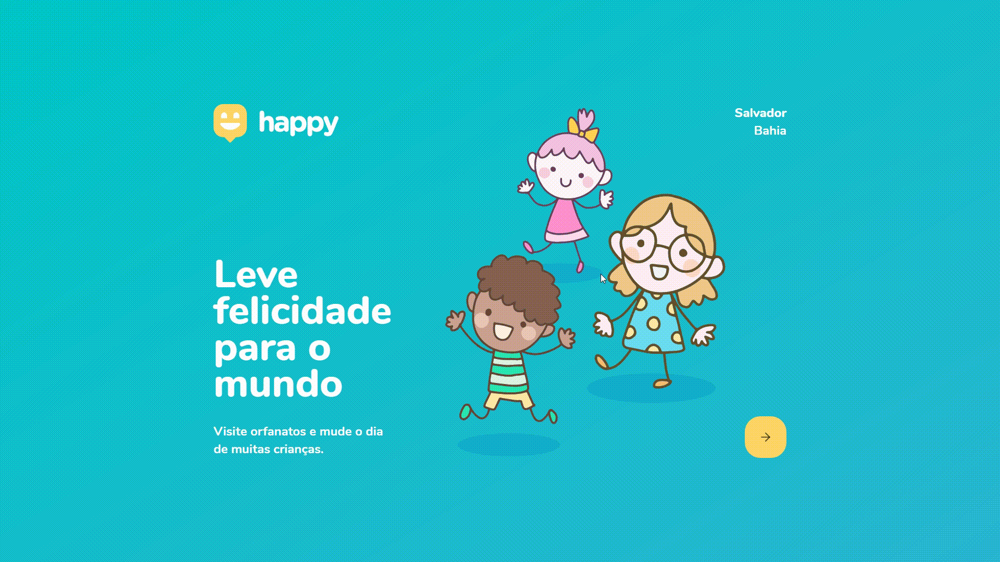

<h1 align="center">
  
</h1>

<h4 align="center"> 
	:heavy_check_mark: Next Level Week #3 - Happy!
</h4>

<p align="center">
  <a href="https://opensource.org/licenses/MIT"></a>
</p>

<p align="center">
  <a href="#interrobang">Happy</a>&nbsp;&nbsp;&nbsp;|&nbsp;&nbsp;&nbsp;
  <a href="#rocket-tecnologias">Tecnologias usadas</a>&nbsp;&nbsp;&nbsp;|&nbsp;&nbsp;&nbsp;
  <a href="#interrobang-como-usar">Como usar</a>&nbsp;&nbsp;&nbsp;|&nbsp;&nbsp;&nbsp;
  <a href="#confetti_ball-como-contribuir">Como contribuir</a>&nbsp;&nbsp;&nbsp;|&nbsp;&nbsp;&nbsp;
  <a href="#key-licença">Licença</a>
</p>


<div align="center">
  
</div>


## :interrobang: O que é o Happy?

O Happy é uma aplicação que se desenvolveu durante a Next Level Week #3, proporcinada pela Rocketseat, que tem como objetivo construir uma aplicação do zero, utilizando as mais modernas tecnologias para desenvolvimento web do mercado.

Dessa forma o Happy foi criado em homenagem ao Dia das Crianças! Além da fomentação à visitação a orfanatos! :blue_heart:

Essa aplicação possibilita as pessoas a encontrarem orfanatos próximos à sua localização, além de trazer todas as informações necessárias para a visitação do orfanato. Também se faz possível o cadastro de orfanatos! 


## :rocket: Tecnologias:

Esse projeto foi desenvolvido com as seguintes tecnologias:

- [React][react]
- [Typescript][typescript]
- [Node.js][nodejs]
- [Express][express]
- [SQLite3][sqlite]
- [HTML][html]
- [CSS][css]

## :construction_worker: Como usar: (Em desenvolvimento)

Para clonar e executar essa aplicação você vai precisar dos seguintes softwares instalados em seu computador: 
- [Git][git]
- [Node][nodejs]
- [Yarn][yarn]

### :electric_plug: Instalar dependências e rodar a aplicação:

```bash
# Clone este repositório:
$ git clone https://github.com/i-ramoss/Next-Level-Week-3-Omnistack.git

# Entre no repositório:
$ cd Next-Level-Week-3-Omnistack
```
#### :computer: Frontend:

```
$ cd web

# Instale as dependências:
$ yarn

or

$ npm install

# Inicie a aplicação
$ yarn start

or

$ npm start
```

#### :gear: Backend:

```
$ cd backend

# Instale as dependências:
$ yarn

or

$ npm install

# Inicie a aplicação
$ yarn dev

or

$ npm run dev
```

## :confetti_ball: Como contribuir:

-  Realize um fork;
-  Crie uma branch com sua funcionalidade: `git checkout -b my-feature`;
-  Envie as mudanças realizadas: `git commit -m 'feat: My new feature'`;
-  Faça um push da sua branch: `git push origin my-feature`.

Depois que a sua solicitação for aceita e adicionada ao projeto, você pode excluir a sua branch.

## :key: Licença:

Este projeto está sob licença MIT, para mais detalhes verifique em [LICENSE][license].

Feito com :purple_heart: por **Ian Ramos** :fire: [Entre em contato!][linkedin]


[react]: https://pt-br.reactjs.org/
[typescript]: https://www.typescriptlang.org/
[nodejs]: https://nodejs.org/en/
[express]: https://expressjs.com/pt-br/
[sqlite]: https://www.sqlite.org/index.html
[html]: https://developer.mozilla.org/pt-BR/docs/Web/HTML
[css]: https://developer.mozilla.org/pt-BR/docs/Web/CSS

[git]: https://git-scm.com
[yarn]: https://yarnpkg.com/
[license]: https://github.com/i-ramoss/Next-Level-Week-3-Omnistack/blob/master/LICENSE
[linkedin]: https://www.linkedin.com/in/ian-ramos/